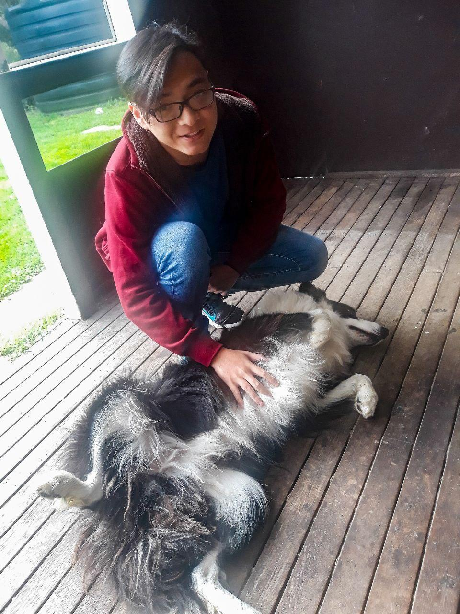
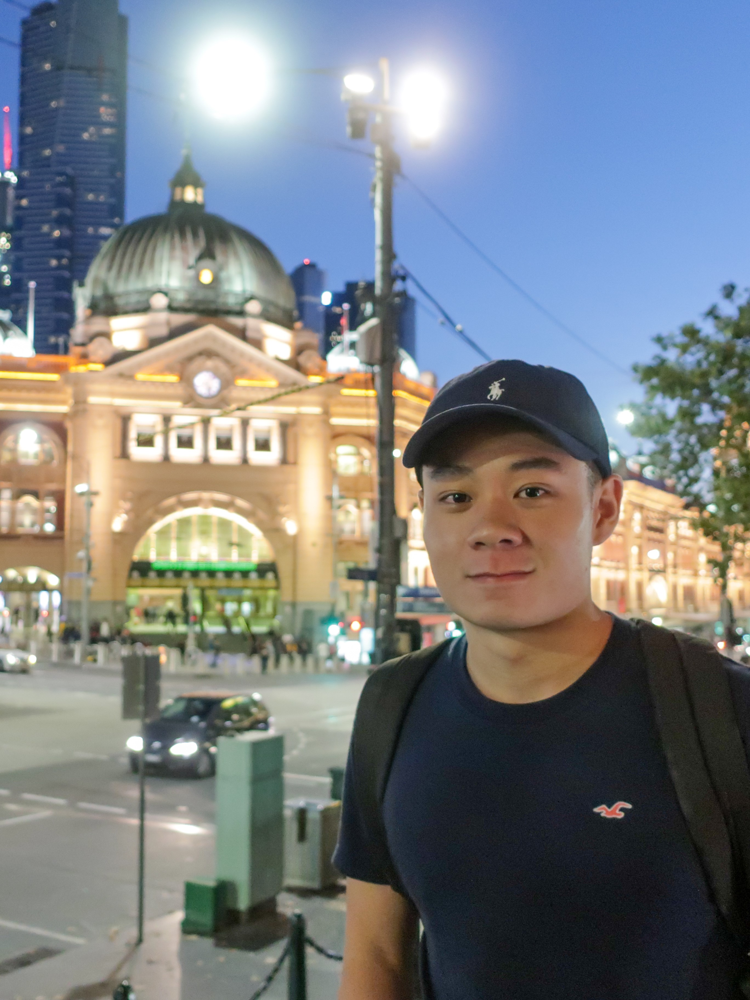
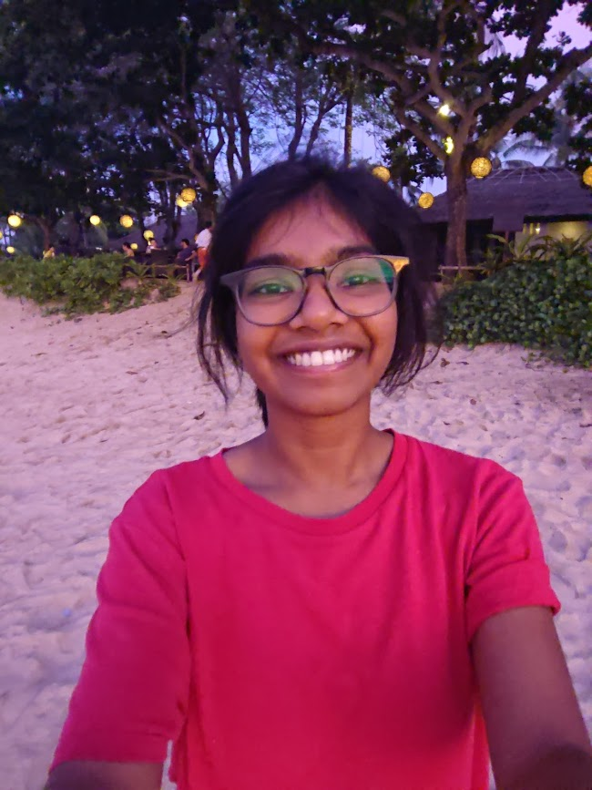
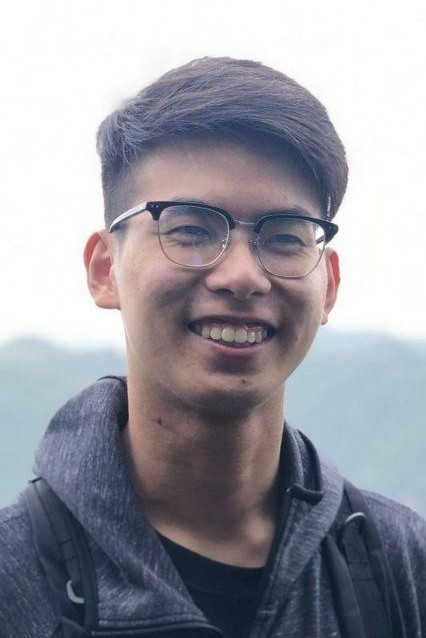

We are a team based in the [School of Computing, National University of Singapore](http://www.comp.nus.edu.sg).

You can reach us at the email seer[at]comp.nus.edu.sg

## Project team

### Joe Tan

[[github](http://github.com/tjwjoe)] [[portfolio](team/tjwjoe.md)]

* Role: Developer
* Responsibilities: Documentation

### Kenny Seet

[[github](https://github.com/kswk)] [[portfolio](team/kswk.md)]

* Role: Developer
* Responsibilities: Deliverables, Deadlines and Integration

### Rayasam Harshini

[[github](http://github.com/rayasamhr)] [[portfolio](team/rayasamhr.md)]

* Role: Developer
* Responsibilities: Code Quality

### Xu Zhizhi

[[github](http://github.com/zhizhizhizhizhi)] [[portfolio](team/zhizhizhizhizhi.md)]

* Role: Developer
* Responsibilities: Testing

### Yang Jiyu

[[github](http://github.com/yangjiyu98)] [[portfolio](team/yangjiyu98.md)]

* Role: Developer
* Responsibilities: Scheduling and Tracking
