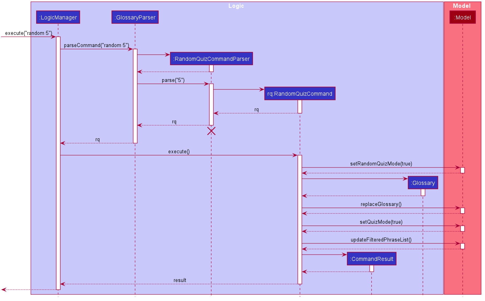

* [**Setting up, getting started**](#setup)
* [**Design**](#design)
   * [Architecture](#architecture)
   * [UI component](#ui_component)
   * [Logic component](#logic_component)
   * [Model component](#model_component)
   * [Storage component](#storage_component)
   * [Common classes](#common_classes)
* [**Implementation**](#implementation)
   * [[Proposed] Undo/redo feature](#undo_redo)
     * [Proposed Implementation](#proposed_implementation)
     * [Design consideration:](#design_consideration)
       * [Aspect: How undo & redo executes](#aspect_undo_redo)
  * [[Proposed] Data archiving](#data_archiving)
* [**Documentation, logging, testing, configuration, dev-ops**](#documentation_etc)
* [**Appendix: Requirements**](#requirements)
  * [Product scope](#product_scope)
  * [User stories](#user_stories)
  * [Use cases](#use_cases)
  * [Non-Functional Requirements](#nfr)
  * [Glossary](#glossary)
* [**Appendix: Instructions for manual testing**](#manual_testing)
  * [Launch and shutdown](#launch_shutdown)
  * [Deleting a student](#deleting_a_flashcard)
  * [Saving data](#saving_data)

--------------------------------------------------------------------------------------------------------------------

## **Setting up, getting started**

Refer to the guide [_Setting up and getting started_](SettingUp.md).

## **Design**

### Architecture

The ***Architecture Diagram*** given above explains the high-level design of the App. Given below is a quick overview of each component.

:bulb: **Tip:** The `.puml` files used to create diagrams in this document can be found in the [diagrams](https://github.com/AY2021S1-CS2103T-W16-2/tp/tree/master/docs/diagrams/) folder. Refer to the [_PlantUML Tutorial_ at se-edu/guides](https://se-education.org/guides/tutorials/plantUml.html) to learn how to create and edit diagrams.

**`Main`** has two classes called [`Main`](https://github.com/AY2021S1-CS2103T-W16-2/tp/blob/master/src/main/java/seedu/forgetfulnus/Main.java) and [`MainApp`](https://github.com/AY2021S1-CS2103T-W16-4/tp/blob/master/src/main/java/seedu/address/MainApp.java). It is responsible for,
* At app launch: Initialises the components in the correct sequence, and connects them up with each other.
* At shut down: Shuts down the components and invokes cleanup methods where necessary.

[**`Commons`**](#common_classes) represents a collection of classes used by multiple other components.

The rest of the App consists of four components.

* [**`UI`**](#ui_component): The UI of the App.
* [**`Logic`**](#logic_component): The command executor.
* [**`Model`**](#model_component): Holds the data of the App in memory.
* [**`Storage`**](#storage_component): Reads data from, and writes data to, the hard disk.

Each of the four components,

* defines its *API* in an `interface` with the same name as the Component.
* exposes its functionality using a concrete `{Component Name}Manager` class (which implements the corresponding API `interface` mentioned in the previous point.
For example, the `Logic` component (see the class diagram given below) defines its API in the `Logic.java` interface and exposes its functionality using the `LogicManager.java` class which implements the `Logic` interface.

**How the architecture components interact with each other**

The *Sequence Diagram* below shows how the components interact with each other for the scenario where the user issues the command `delete 1`.

The sections below give more details of each component.

### UI component

**API** :
[`Ui.java`](https://github.com/AY2021S1-CS2103T-W16-2/tp/tree/master/src/main/java/seedu/forgetfulnus/ui/Ui.java)

The UI consists of a `MainWindow` that is made up of parts e.g.`CommandBox`, `ResultDisplay`, `PersonListPanel`, `StatusBarFooter` etc. All these, including the `MainWindow`, inherit from the abstract `UiPart` class.

The `UI` component uses JavaFx UI framework. The layout of these UI parts are defined in matching `.fxml` files that are in the `src/main/resources/view` folder. For example, the layout of the [`MainWindow`](https://github.com/se-edu/addressbook-level3/tree/master/src/main/java/seedu/address/ui/MainWindow.java) is specified in [`MainWindow.fxml`](https://github.com/se-edu/addressbook-level3/tree/master/src/main/resources/view/MainWindow.fxml)

The `UI` component,

* Executes user commands using the `Logic` component.
* Listens for changes to `Model` data so that the UI can be updated with the modified data.

### Logic component

**API** :
[`Logic.java`](https://github.com/AY2021S1-CS2103T-W16-2/tp/tree/master/src/main/java/seedu/forgetfulnus/logic/Logic.java)

1. `Logic` uses the `GlossaryBookParser` class to parse the user command.
1. This results in a `Command` object which is executed by the `LogicManager`.
1. The command execution can affect the `Model` (e.g. adding a Flashcard).
1. The result of the command execution is encapsulated as a `CommandResult` object which is passed back to the `Ui`.
1. In addition, the `CommandResult` object can also instruct the `Ui` to perform certain actions, such as displaying help to the user.

Given below is the Sequence Diagram for interactions within the `Logic` component for the `execute("add g/German e/English")` API call.

:information_source: **Note:** The lifeline for `AddCommandParser` should end at the destroy marker (X) but due to a limitation of PlantUML, the lifeline reaches the end of diagram.

### Model component

**API** : [`Model.java`](https://github.com/AY2021S1-CS2103T-W16-2/tp/tree/master/src/main/java/seedu/forgetfulnus/model/Model.java)

The `Model`,

* stores a `UserPref` object that represents the user’s preferences.
* stores the glossary data.
* exposes an unmodifiable `ObservableList<Flashcard>` that can be 'observed' e.g. the UI can be bound to this list so that the UI automatically updates when the data in the list change.
* does not depend on any of the other three components.

:information_source: **Note:** An alternative (arguably, a more OOP) model is given below. It has a `Tag` list in the `Glossary`, which `Flashcard` references. This allows `Glossary` to only require one `Tag` object per unique `Tag`, instead of each `Flashcard` needing their own `Tag` object. 

### Storage component

**API** : [`Storage.java`](https://github.com/AY2021S1-CS2103T-W16-2/tp/tree/master/src/main/java/seedu/forgetfulnus/storage/Storage.java)

The `Storage` component,
* can save `UserPref` objects in json format and read it back.
* can save the address book data in json format and read it back.

### Common classes

Classes used by multiple components are in the `seedu.forgetfulnus.commons` package.
--------------------------------------------------------------------------------------------------------------------
## **Implementation**

This section describes some noteworthy details on how certain features are implemented.

### Randomly generating a specified number of flashcards from the glossary to self-test

This feature is facilitated by `RandomQuizCommand` and `RandomQuizCommandParser` and `Model`.

`RandomQuizCommand` implements the method:

* `RandomQuizCommand#execute(Model)` — Returns a `CommandResult` which begins a round of vocabulary quiz containing the specified number of flashcards randomly selected from the existing glossary.

`RandomQuizCommandParser` implements the method:

* `RandomQuizCommandParser#parse(String)` — Returns a `RandomQuizCommand` which ensures the specified number of flashcards is valid.

`Model` implements the method:

* `Model#setRandomQuizMode(boolean)` — Sets the state of Model to randomQuizMode and backs up or retrieves the original glossary depending on the boolean value.

Given below is an example usage scenario and how the random quiz mechanism behaves at each step.

Step 1. The user launches the application with an existing glossary of flashcards that the user added previously.

Step 2. The user executes `random 5` command to randomly select 5 flashcards from the existing glossary to test his/her own vocabulary. The `random 5` command calls `RandomQuizCommandParser#parse(String)` which checks the validity of the argument given to `random` command. This then leads to the calling of `RandomQuizCommand#execute(Model)`, which in turn calls the `Model#setRandomQuizMode(boolean)`.

Step 3. The change of state of the Model resulting from `Model#setRandomQuizMode(boolean)` starts a round of vocabulary quiz for the user when the boolean parameter provided is true.

The following sequence diagram shows how the random quiz mechanism works:

The following activity diagram summarises what happens when a user executes the random command:

### Setting difficulty level for flashcards

The following activity diagram summarises what happens for the `DifficultyTag` when a user executes the Add command:

### \[Proposed\] Undo/redo feature

#### Proposed Implementation

The proposed undo/redo mechanism is facilitated by `VersionedAddressBook`. It extends `AddressBook` with an undo/redo history, stored internally as an `addressBookStateList` and `currentStatePointer`. Additionally, it implements the following operations:

* `VersionedAddressBook#commit()` — Saves the current address book state in its history.
* `VersionedAddressBook#undo()` — Restores the previous address book state from its history.
* `VersionedAddressBook#redo()` — Restores a previously undone address book state from its history.

These operations are exposed in the `Model` interface as `Model#commitAddressBook()`, `Model#undoAddressBook()` and `Model#redoAddressBook()` respectively.

Given below is an example usage scenario and how the undo/redo mechanism behaves at each step.

Step 1. The user launches the application for the first time. The `VersionedAddressBook` will be initialized with the initial address book state, and the `currentStatePointer` pointing to that single address book state.

Step 2. The user executes `delete 5` command to delete the 5th student in the address book. The `delete` command calls `Model#commitAddressBook()`, causing the modified state of the address book after the `delete 5` command executes to be saved in the `addressBookStateList`, and the `currentStatePointer` is shifted to the newly inserted address book state.

Step 3. The user executes `add n/David …​` to add a new student. The `add` command also calls `Model#commitAddressBook()`, causing another modified address book state to be saved into the `addressBookStateList`.

:information_source: **Note:** If a command fails its execution, it will not call `Model#commitAddressBook()`, so the address book state will not be saved into the `addressBookStateList`.

Step 4. The user now decides that adding the student was a mistake, and decides to undo that action by executing the `undo` command. The `undo` command will call `Model#undoAddressBook()`, which will shift the `currentStatePointer` once to the left, pointing it to the previous address book state, and restores the address book to that state.

:information_source: **Note:** If the `currentStatePointer` is at index 0, pointing to the initial AddressBook state, then there are no previous AddressBook states to restore. The `undo` command uses `Model#canUndoAddressBook()` to check if this is the case. If so, it will return an error to the user rather
than attempting to perform the undo.

The following sequence diagram shows how the undo operation works:

:information_source: **Note:** The lifeline for `UndoCommand` should end at the destroy marker (X) but due to a limitation of PlantUML, the lifeline reaches the end of diagram.

The `redo` command does the opposite — it calls `Model#redoAddressBook()`, which shifts the `currentStatePointer` once to the right, pointing to the previously undone state, and restores the address book to that state.

:information_source: **Note:** If the `currentStatePointer` is at index `addressBookStateList.size() - 1`, pointing to the latest address book state, then there are no undone AddressBook states to restore. The `redo` command uses `Model#canRedoAddressBook()` to check if this is the case. If so, it will return an error to the user rather than attempting to perform the redo.

Step 5. The user then decides to execute the command `list`. Commands that do not modify the address book, such as `list`, will usually not call `Model#commitAddressBook()`, `Model#undoAddressBook()` or `Model#redoAddressBook()`. Thus, the `addressBookStateList` remains unchanged.

Step 6. The user executes `clear`, which calls `Model#commitAddressBook()`. Since the `currentStatePointer` is not pointing at the end of the `addressBookStateList`, all address book states after the `currentStatePointer` will be purged. Reason: It no longer makes sense to redo the `add n/David …​` command. This is the behavior that most modern desktop applications follow.

The following activity diagram summarizes what happens when a user executes a new command:

#### Design consideration:

##### Aspect: How undo & redo executes

* **Alternative 1 (current choice):** Saves the entire address book.
 * Pros: Easy to implement.
 * Cons: May have performance issues in terms of memory usage.

* **Alternative 2:** Individual command knows how to undo/redo by
 itself.
 * Pros: Will use less memory (e.g. for `delete`, just save the student being deleted).
 * Cons: We must ensure that the implementation of each individual command are correct.

_{more aspects and alternatives to be added}_

### \[Proposed\] Data archiving

_{Explain here how the data archiving feature will be implemented}_

--------------------------------------------------------------------------------------------------------------------
## **Documentation, logging, testing, configuration, dev-ops**

* [Documentation guide](Documentation.md)
* [Testing guide](Testing.md)
* [Logging guide](Logging.md)
* [Configuration guide](Configuration.md)
* [DevOps guide](DevOps.md)
--------------------------------------------------------------------------------------------------------------------
## **Appendix: Requirements**

### Product scope

#### **Target user profile**:

ForgetfulNUS is targeted at students taking level 1000-2000 German language modules at the NUS Center of Language Studies who can type fast and prefer typing to mouse interactions.

#### **Value proposition**: 

A flashcard CLI app designed to cater to the specific needs of the target user to help them learn their German vocabularies.  

### User Stories

Priorities: High (must have) - `* * *`, Medium (nice to have) - `* *`, Low (unlikely to have) - `*`

Priority | As a... | I want to... | So that I...
--- | ---------- | --------- | ---- |
*** | user |add a flashcard with German phrase and meaning | can refer it or use it to test myself later.
*** | user | list out all the flashcards with index | can look through the phrases and their meanings to study.
*** | user | delete a flash card by index
*** | user | test myself with the flashcards | can be quizzed on the phrases and their meanings.
** | user | my flashcards to be saved (storage) | can use them when I next launch the app.

### Use Cases

(For all use cases below, the **System** is `ForgetfulNUS` and the **Actor** is the `user`, unless specified otherwise)

#### **Use Case: UC1- Add a flashcard**

**MSS:**

1.  User adds a flashcard with German phrase and meaning.
2.  ForgetfulNUS adds the flashcard and display the newly-added flashcard.

    Use case ends.

**Extensions:**

- 1a. ForgetfulNUS detects less than 2 fields for the flashcard.

    - 1a1. ForgetfulNUS requests the User to input phrase and meaning for the flashcard.     
    - 1a2. User enters a new flashcard or terminates the process.
    
    Steps 1a1-1a2 are repeated until the user input is correct or the user terminates the process.

   Use case ends.

#### **Use case: UC2 - List all flashcards**

**MSS:**

1.  User requests ForgetfulNUS to list all the flashcards.
2.  ForgetfulNUS shows the list of flashcards.
    
    Use case ends.

**Extensions:**

- 1a. ForgetfulNUS detects incorrect command.

    - 1a1. ForgetfulNUS shows error and asks for a command in the correct format. 
    
    - 1a2. User enters a command.

   Use case ends.

#### **Use case: UC3 - Delete a flashcard**

**MSS:**

1.  User deletes a flashcard by the index.
2.  ForgetfulNUS displays the flashcard to be deleted and asks for confirmation.
3.  User confirms deletion of flashcard.
4.  ForgetfulNUS deletes the flashcard.
    
    Use case ends.

**Extensions:**

- 3a. User chooses to not delete the flashcard at confirmation.

    - 3a1. ForgetfulNUS terminates the process. 
    
   Use case ends.
   
### **Use case: UC4 - Self-testing with flashcards**

**MSS:**

1. User requests to start self-testing.
2. ForgetfulNUS displays a german word.
3. User inputs the corresponding english translation.
4. ForgetfulNUS displays the results of User's answer.
    
    Steps 2-4 are repeated until there are no more words to be tested.    
    
    Use case ends.

**Extensions:**
   
- 4a. At any time, User chooses to stop self-testing.
      
   - 4a1. ForgetfulNUS stops self-testing.
      
   Use case ends.

*{More to be added soon}*
    
### Non-Functional Requirements

1. Should work on any mainstream OS as long as it has Java 11 or above installed.
2. A user with above average typing speed for regular English text should be able to accomplish most of the tasks faster using commands than using the mouse.
3. German diacritics (eg. ä) should be fully supported in being saved and displayed by the UI.
4. Verification of user input in testing mode should not take more than 2 seconds.

### Glossary

* **Mainstream OS:** Windows, Linux, Unix, OS-X
* **Flashcard:** An item containing (a) a German phrase (b) the corresponding English definition
* **German phrase:** German text of any length
* **Index:** Position of flashcard in the list of flashcards displayed to the user
* **CLI:** Command Line Interface
--------------------------------------------------------------------------------------------------------------------
## **Appendix: Instructions for manual testing**

Given below are instructions to test the app manually.

:information_source: **Note:** These instructions only provide a starting point for testers to work on;
testers are expected to do more *exploratory* testing.

### Launch and shutdown

1. Initial launch

   1. Download the jar file and copy into an empty folder

   1. Double-click the jar file Expected: Shows the GUI with a set of sample flashcards. The window size may not be optimum.

1. Saving window preferences

   1. Resize the window to an optimum size. Move the window to a different location. Close the window.

   1. Re-launch the app by double-clicking the jar file. 
       Expected: The most recent window size and location is retained.

1. _{ more test cases …​ }_

### Deleting a flashcard

1. Deleting a flashcard while all flashcards are being shown

   1. Prerequisites: List all flashcards using the `list` command. Multiple flashcards in the list.

   1. Test case: `delete 1` 
      Expected: First flashcard is deleted from the list. Details of the deleted flashcard shown in the status message. Timestamp in the status bar is updated.

   1. Test case: `delete 0` 
      Expected: No flashcard is deleted. Error details shown in the status message. Status bar remains the same.

   1. Other incorrect delete commands to try: `delete`, `delete x`, `...` (where x is larger than the list size) 
      Expected: Similar to previous.

1. _{ more test cases …​ }_

### Saving data

1. Dealing with missing/corrupted data files

   1. _{explain how to simulate a missing/corrupted file, and the expected behavior}_

1. _{ more test cases …​ }_
