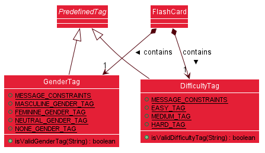
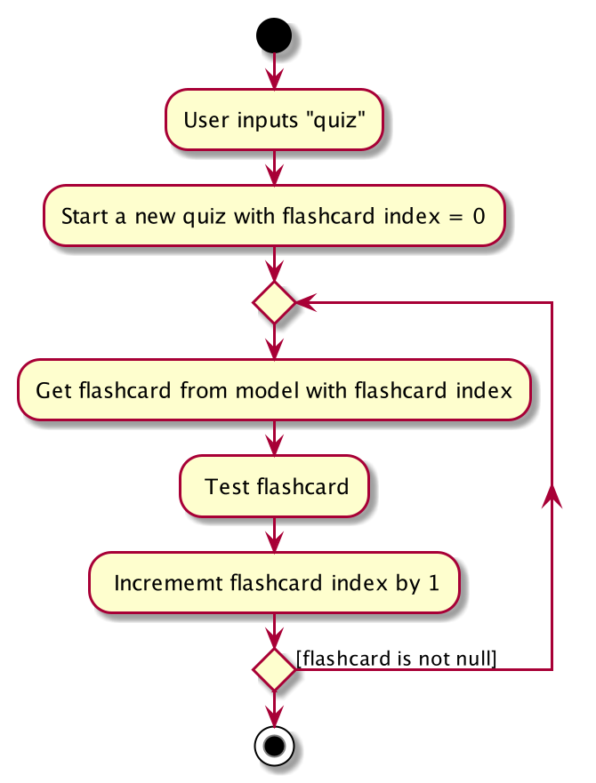

ForgetfulNUS is a desktop glossary app for students taking German 1 (LAG1201)
and German 2 (LAG2201) in NUS to practise and test their vocabulary, optimised
for use via a Command Line Interface (CLI). * This project is based on the 
AddressBook-Level3 project created by the [SE-EDU initiative](https://se-education.org).

## Table of Contents
1. [**Setting Up, Getting Started**](#setup)
1. [**Design**](#design)
    1. [Architecture](#architecture)
    1. [UI Component](#ui_component)
    1. [Logic Component](#logic_component)
    1. [Model Component](#model_component)
    1. [Storage Component](#storage_component)
    1. [Common Classes](#common_classes)
1. [**Implementation**](#implementation)
    1. [Predefined Tags](#predefined_tags)
    1. [Quizzing](#quizzing)
    1. [Random Quizzing](#random)
    1. [Scoring](#scoring)
    1. [Sorting](#sorting)
1. [**Documentation, Logging, Testing, Configuration, Dev-Ops**](#documentation_etc)
1. [**Appendix: Requirements**](#requirements)
    1. [Product scope](#product_scope)
    1. [User stories](#user_stories)
    1. [Use cases](#use_cases)
    1. [Non-Functional Requirements](#nfr)
    1. [Glossary](#glossary)
1. [**Appendix: Instructions for Manual Testing**](#manual_testing)
    1. [Launching and Shutting Down](#launch_shutdown)
    1. [Deleting a Flashcard](#deleting_a_flashcard)
    1. [Sorting Flashcards](#sorting_flashcards)
    1. [Saving Data](#saving_data)

--------------------------------------------------------------------------------------------------------------------

## **Setting Up, Getting Started**

Refer to the guide [_Setting Up and Getting Started_](SettingUp.md).

## **Design**

### Architecture

The ***Architecture Diagram*** given above explains the high-level design of the App. Given below is a quick overview of each component.

:bulb: **Tip:** The `.puml` files used to create diagrams in this document can be found in the [diagrams](https://github.com/AY2021S1-CS2103T-W16-2/tp/tree/master/docs/diagrams/) folder. Refer to the [_PlantUML Tutorial_ at se-edu/guides](https://se-education.org/guides/tutorials/plantUml.html) to learn how to create and edit diagrams.

**`Main`** has two classes called [`Main`](https://github.com/AY2021S1-CS2103T-W16-2/tp/blob/master/src/main/java/seedu/forgetfulnus/Main.java) and [`MainApp`](https://github.com/AY2021S1-CS2103T-W16-4/tp/blob/master/src/main/java/seedu/address/MainApp.java). It is responsible for,
* At app launch: Initialises the components in the correct sequence, and connects them up with each other.
* At shut down: Shuts down the components and invokes cleanup methods where necessary.

[**`Commons`**](#common_classes) represents a collection of classes used by multiple other components.

The rest of the App consists of four components.

* [**`UI`**](#ui_component): The UI of the App.
* [**`Logic`**](#logic_component): The command executor.
* [**`Model`**](#model_component): Holds the data of the App in memory.
* [**`Storage`**](#storage_component): Reads data from, and writes data to, the hard disk.

Each of the four components,

* defines its *API* in an `interface` with the same name as the Component.
* exposes its functionality using a concrete `{Component Name}Manager` class (which implements the corresponding API `interface` mentioned in the previous point.
For example, the `Logic` component (see the class diagram given below) defines its API in the `Logic.java` interface and exposes its functionality using the `LogicManager.java` class which implements the `Logic` interface.

**How the architecture components interact with each other**

The *Sequence Diagram* below shows how the components interact with each other for the scenario where the user issues the command `delete 1`.

The sections below give more details of each component.

### UI Component

**API** :
[`Ui.java`](https://github.com/AY2021S1-CS2103T-W16-2/tp/tree/master/src/main/java/seedu/forgetfulnus/ui/Ui.java)

The UI consists of a `MainWindow` that is made up of parts e.g.`CommandBox`, `ResultDisplay`, `PersonListPanel`, `StatusBarFooter` etc. All these, including the `MainWindow`, inherit from the abstract `UiPart` class.

The `UI` component uses JavaFx UI framework. The layout of these UI parts are defined in matching `.fxml` files that are in the `src/main/resources/view` folder. For example, the layout of the [`MainWindow`](https://github.com/se-edu/addressbook-level3/tree/master/src/main/java/seedu/address/ui/MainWindow.java) is specified in [`MainWindow.fxml`](https://github.com/se-edu/addressbook-level3/tree/master/src/main/resources/view/MainWindow.fxml)

The `UI` component,

* Executes user commands using the `Logic` component.
* Listens for changes to `Model` data so that the UI can be updated with the modified data.

### Logic Component

**API** :
[`Logic.java`](https://github.com/AY2021S1-CS2103T-W16-2/tp/tree/master/src/main/java/seedu/forgetfulnus/logic/Logic.java)

1. `Logic` uses the `GlossaryBookParser` class to parse the user command.
1. This results in a `Command` object which is executed by the `LogicManager`.
1. The command execution can affect the `Model` (e.g. adding a Flashcard).
1. The result of the command execution is encapsulated as a `CommandResult` object which is passed back to the `Ui`.
1. In addition, the `CommandResult` object can also instruct the `Ui` to perform certain actions, such as displaying help to the user.

Given below is the Sequence Diagram for interactions within the `Logic` component for the `execute("add g/German e/English")` API call.

:information_source: **Note:** The lifeline for `AddCommandParser` should end at the destroy marker (X) but due to a limitation of PlantUML, the lifeline reaches the end of diagram.

### Model Component

**API** : [`Model.java`](https://github.com/AY2021S1-CS2103T-W16-2/tp/tree/master/src/main/java/seedu/forgetfulnus/model/Model.java)

The `Model`,

* stores a `UserPref` object that represents the user’s preferences.
* stores the glossary data.
* exposes an unmodifiable `ObservableList<Flashcard>` that can be 'observed' e.g. the UI can be bound to this list so that the UI automatically updates when the data in the list change.
* does not depend on any of the other three components.

### Storage Component

**API** : [`Storage.java`](https://github.com/AY2021S1-CS2103T-W16-2/tp/tree/master/src/main/java/seedu/forgetfulnus/storage/Storage.java)

The Storage component,

* can save `UserPref` objects in json format and read it back.
* can save the address book data in json format and read it back.
* can save the user scores data in json format and read it back.

`JsonAdaptedFlashCard` and `JsonAdaptedScore` are Json-friendly versions of 
the `Model`’s respective `FlashCard` and `Score` classes. Similarly, `JsonScoreList` and 
`JsonSerializableGlossary` are Json-friendly versions of the `Model`’s respective `UniqueFlashCardList` and `UniqueScoreList` classes. These Json-friendly classes handle Json serialization and deserialization, so glossary and score data can be saved and read from their respective .json files.

### Common Classes

Classes used by multiple components are in the `seedu.forgetfulnus.commons` package.

--------------------------------------------------------------------------------------------------------------------
## **Implementation**

This section describes some noteworthy details on how certain features are implemented.

###  Predefined Tags

This feature is facilitated by `PredefinedTags`, `DifficultyTag` and `GenderTag`.

There are two types of predefined tags for each flash cards. They are the `DifficultyTag` and `GenderTag`. 

The following class diagram outlines the structure of the predefined tags and how it interacts with other `Model` components.

To go for a more OOP solution, both `DifficultyTag` and `GenderTag` were made to extend from an abstract class `PredefinedTag`.
 
Referring to the class diagram above, note that `DifficultyTag` also implements `Comparable` for use in the sorting feature. As ForgetfulNUS does not support sorting by `GenderTag`, it does not implement `Comparable`.

The following activity diagram summarises what happens for the `DifficultyTag` when a user executes the Add command:

For `GenderTag` the activity diagram is similar, with the default tag being set to `NONE` instead. Note that even if a flashcard does not appear to have a `GenderTag`  on the UI, each flashcard will always have a `GenderTag`. The UI will just not display anything for a `NONE` state.

###  Quizzing
The proposed quiz feature for users to test their vocabulary is facilitated by `Model` and `Command`. It does so by allowing a command to set `Model` to quiz mode. When the model is in quiz mode, it will take in commands allowing users to attempt to type the correct definition, skip the flashcard under test or end the quiz.

It implements the following operations:

* `Glossary#quiz(Model)` — Starts the quizzing with the displayed flashcard list.
* `Glossary#try(Model)` — Attempt to type the correct English definition of the German phrase on the current flashcard.
* `Glossary#next(Model)` — Skips the current flashcard under test.
* `Glossary#end(Model)` — Ends the quiz.

These operations are exposed in `Ui` as commands. They are implemented by `QuizCommand`, `TryCommand`, `NextCommand` and `EndQuizCommand` respectively.

Given below is an example usage scenario and how the quiz mechanism behaves at each step.

Step 1: The user launches the application with an existing list of flashcard. Flashcards from this list will be tested in the order of their index, and the list can be customised by using the `find <search phrase>` command.

Step 2: User enters `quiz` and the program will execute the QuizCommand on the current model. The model will be set to quiz mode and will be expecting quiz commands like `try <attempt>`, `next` and `end`. The Ui will update to hide all the English definitions on the flashcards. The first flashcard on the list will be tested when the quiz begins.

Step 3: The user enters `try <attempt>` and the `GlossaryParser#parse(String)` will parse input into a TryCommand with the attempt. If the attempt matches the English definition of the flashcard, the flashcard index, score and question count in `model` increment. The Ui will update to show the English definition of the current flashcard. The next flashcard on the list will be tested. 

If the attempt does not match, step 3 will repeat.
Alternatively, the user can enter `next` to execute the NextCommand on the model. The flashcard index and question count in `model` will increment, the Ui will update to show the English definition of the current flashcard andthe next flashcard and the next flashcard will be tested. 

Step 4: The quiz mode will end when there is no next flashcard i.e. current flashcard is the last on the list, and the user attempts the English definition correctly with `try <attempt>` or the user skips the card with `next`. Alternatively, the quiz can be ended early at any point during the quiz when the user enters `end`, letting the program execute the EndQuizCommand on the current model. The Ui will update to show the English definitions on all the flashcards in the flashcard list.

The following activity diagram outlines the process of quizzing:

The following sequence diagram shows how the quiz operation works:

Quizzing also works in tandem with `find` and `sort` features, allowing users to limit the phrases tested and change the order of testing.

During quizzing, only `try`, `next` and `end` commands are allowed to be used. All other commands except `help` and `exit` will remind the user that they are in quiz mode and to end the quiz first before using any other commands.

###  Random Quizzing

This feature is facilitated by `RandomQuizCommand` and `RandomQuizCommandParser` and `Model`.

`RandomQuizCommand` implements the method:

* `RandomQuizCommand#execute(Model)` — Returns a `CommandResult` which begins a round of vocabulary quiz containing the specified number of flashcards randomly selected from the existing glossary.

`RandomQuizCommandParser` implements the method:

* `RandomQuizCommandParser#parse(String)` — Returns a `RandomQuizCommand` which ensures the specified number of flashcards is valid.

`Model` implements the method:

* `Model#setRandomQuizMode(boolean)` — Sets the state of Model to randomQuizMode and backs up or retrieves the original glossary depending on the boolean value.

Given below is an example usage scenario and how the random quiz mechanism behaves at each step.

Step 1. The user launches the application with an existing glossary of flashcards that the user added previously.

Step 2. The user executes `random 5` command to randomly select 5 flashcards from the existing glossary to test his/her own vocabulary. The `random 5` command calls `RandomQuizCommandParser#parse(String)` which checks the validity of the argument given to `random` command. This then leads to the calling of `RandomQuizCommand#execute(Model)`, which in turn calls the `Model#setRandomQuizMode(boolean)`.

Step 3. The change of state of the Model resulting from `Model#setRandomQuizMode(boolean)` starts a round of vocabulary quiz for the user when the boolean parameter provided is true.

The following sequence diagram shows how the random quiz mechanism works:

The following activity diagram summarises what happens when a user executes the random command:

### \[Implemented\] Saving Score History

This feature saves scores from previous rounds of quizzing. It is facilitated by classes in the `Command`, `Model` and `Storage` components.

A list of past scores is saved in a local file, which is exposed in the `Storage` interface as `Storage#getScoreFilePath()`.

Scores are encapsulated in the `Model` by `Score` objects, which store scoring information that can be retrieved from the following methods:

* `Score#getScore()` - Returns the number of flashcards answered correctly in the quizzing round
* `Score#getNumQuestions()` - Returns the number of flashcards tested in the quizzing round
* `Score#getFlashcards()` - Returns a list of flashcards tested in the quizzing round

Each time the quiz mode is entered and ended, a `Score` object is created and added to a `ScoreList`, where the following methods are implemented:

* `ScoreList#addScore()`
* `ScoreList#getScoreList()`

The scores can be retrieved and viewed by entering the `scores` command. The following sequence diagram
summarises how retrieving the scores works:

#### Design Considerations:

Storing `Flashcard`s in each `Score`:

* **Current Implementation**: Each `Score` object contains a list of each `Flashcard` tested in a round. 
This is a potentially storage-intensive feature that could result in the same flashcard being saved in 
multiple scores. This would cause duplication of data in the `scores.json` data storage file.
* **Alternative**: Currently, the only score information displayed to the user on use of the 
`scores` command are:
    * Number of flashcards answered correctly
    * Number of flashcards tested
    * List of German phrases tested
    
    Therefore, each `Score` object could just store a list of German phrases tested (as Strings) instead of a list of `Flashcard`s. This reduces storage use as each `Flashcard` object contains additional data fields that are not used in the score history feature, like tags.

* **Justification for Current Implementation**: Storing all `Flashcard`s allows possible future extensions of the score history feature, such as:
    * A feature to test all flashcards associated with a particular score, allowing users to improve their performance
    * A feature to display whether each flashcard was answered correctly in a particular round of quizzing. Storing `Flashcard`s allows this information to easily be added to each `Flashcard` as a data field.

###  Sorting

The Sort feature is implemented as a way for users to further customise their view of the glossary and make it easier for them to find phrases they want.

Sorting is implemented as a `SortCommand` class which extends from the abstract `Command` class and makes use of a `SortCommandParser` and `GlossaryParser` to parse the parameters input by the user.
This is in line with the original AddressBook3's Command pattern.

`SortCommand` relies on several pre-defined `Comparator` objects to execute the sorting, one of which is selected for use when
the user's input is successfully parsed by `SortCommandParser`. For example, when the user inputs `sort english`, a SortCommand object is created
with a `Comparator` to compare the `EnglishPhrase`s of each `FlashCard` object in the `Glossary`.

This class diagram outlines the structure of `SortCommand` and `SortCommand` and how they interact with 
other aspects of the program.

The following sequence diagram briefly outlines the execution process when a user enters the command "sort english":

1. The user command is first passed into `LogicManager`, which calls upon `GlossaryParser` to parse the command.
1. `GlossaryParser` identifies the input as a command to sort the glossary, creates a `SortCommandParser` and calls its `parse(String)` method.
1. The new `SortCommandParser` parses the parameter and creates a new `SortCommand`.
1. `LogicManager` calls the new `SortCommand`'s `execute(model)` method.
1. `execute()` calls `SortCommand`'s own `getSortedGlossary()` method to obtain a sorted `Glossary`.
1. The sorted `Glossary` replaces the current `Glossary` in `Model`.
1. The result of the command execution is encapsulated as a CommandResult object which is passed back to the `Ui`.

**Note:** The lifeline for `SortCommandParser` should end at the destroy marker (X) but due to a limitation of PlantUML, the lifeline reaches the end of diagram.

#### Alternatives:
1. Sorting replaces the entire Glossary with a new sorted Glossary (current implementation)

   - Pros: Fairly adaptable from existing commands
   - Cons: Large glossary size may lead to computational delays and overhead

1. Sorting sorts the current Glossary in place instead of creating a new Glossary

   - Pros: Less computational overhead
   - Cons: Original AB3 implementation uses immutable Glossary equivalent, requires very significant refactoring of code to achieve.
   Using a mutable Glossary also makes the code more vulnerable.

--------------------------------------------------------------------------------------------------------------------
## **Documentation, logging, testing, configuration, dev-ops**

* [Documentation guide](Documentation.md)
* [Testing guide](Testing.md)
* [Logging guide](Logging.md)
* [Configuration guide](Configuration.md)
* [DevOps guide](DevOps.md)
--------------------------------------------------------------------------------------------------------------------
## **Appendix: Requirements**

### Product scope

#### **Target user profile**:

ForgetfulNUS is targeted at students taking level 1000-2000 German language modules (LAG1201 and LAG2201) at the NUS Center of Language Studies who can type fast and prefer typing to mouse interactions.

#### **Value proposition**: 

A flashcard CLI app designed to cater to the specific needs of the target user to help them learn their German vocabularies.  

### User Stories

Priorities: High (must have) - `* * *`, Medium (nice to have) - `* *`, Low (unlikely to have) - `*`

Priority | As a... | I want to... | So that I...
--- | ---------- | --------- | ---- |
*** | user |add a flashcard with German phrase and meaning | can refer it or use it to test myself later.
*** | user | list out all the flashcards with index | can look through the phrases and their meanings to study.
*** | user | delete a flash card by index | can remove flashcards that I deem irrelevant.
*** | user | test myself with the flashcards | can be quizzed on the phrases and their meanings.
** | user | my flashcards to be saved (storage) | can use them when I next launch the app.
** | user | to sort my flashcards in certain ways | can navigate the glossary more easily.
** | user | test myself with a randomised quiz | can do a quick quiz to jog my memory.
** | user | edit an existing flashcard's fields | can make any changes to existing flashcards if I want to.
** | user | search for a specific flashcard | can find a specific flashcard more easily.
** | user | save the scores of my previous quizzes | can keep track of my progress easily.
** | user | reset the glossary | can start from scratch with my own personalised data.
* | user | be reminded to quiz myself daily | can be reminded to consistently put in effort to revise.
* | user | hard reset my score history | can start over from scratch.

### Use Cases

(For all use cases below, the **System** is `ForgetfulNUS` and the **Actor** is the `user`, unless specified otherwise)

#### **Use Case: UC1 - Add a flashcard**

**MSS:**

1.  User adds a flashcard with German phrase and meaning.
2.  ForgetfulNUS adds the flashcard and display the newly-added flashcard.

    Use case ends.

**Extensions:**

- 1a. ForgetfulNUS detects less than 2 fields for the flashcard.

    - 1a1. ForgetfulNUS requests the User to input a German phrase and an English translation for the flashcard.     
    - 1a2. User enters a new flashcard or terminates the process.
    
    Steps 1a1-1a2 are repeated until the user input is correct or the user terminates the process.

   Use case ends.

#### **Use case: UC2 - List all Flashcards**

**MSS:**

1.  User requests ForgetfulNUS to list all the flashcards.
2.  ForgetfulNUS shows the list of flashcards.
    
    Use case ends.

**Extensions:**

- 1a. ForgetfulNUS detects incorrect command.

    - 1a1. ForgetfulNUS shows error and asks for a command in the correct format. 
    
    - 1a2. User enters a command.

   Use case ends.

#### **Use case: UC3 - Delete a Flashcard**

**MSS:**

1.  User deletes a flashcard by the index.
2.  ForgetfulNUS deletes the flashcard and displays the information of the deleted flashcard.

   Use case ends.

**Extensions:**

- 1a. User inputs an invalid index (e.g -1)

    - 3a1. ForgetfulNUS shows error and asks for a command in the correct format.
    
    - 3a2. User enters a command with the correct format.
    
   Use case ends.
   
#### **Use case: UC4 - Self-testing with Flashcards**

**MSS:**

1. User requests to start self-testing.
2. ForgetfulNUS displays a German word.
3. User inputs the corresponding English translation.
4. ForgetfulNUS displays the results of User's answer.

    Steps 2-4 are repeated until there are no more words to be tested.    

   Use case ends.

**Extensions:**

- 2a. User chooses to skip the German word.
    
    -2a1. ForgetfulNUS displays the next German word.
    
- 3a. User inputs the wrong English translation.

    - 3a1. ForgetfulNUS prompts the user to try again.

- 4a. At any time, User chooses to stop self-testing.

   - 4a1. ForgetfulNUS stops self-testing.

   Use case ends.

#### **Use case: UC5 - Sorting the Glossary**

**MSS:**

1. User requests to sort the glossary according to a parameter.
2. ForgetfulNUS sorts the glossary according to the parameter.

   Use case ends.

**Extensions:**

- 1a. The glossary is currently empty.

    - 1a1. ForgetfulNUS informs the user that the glossary is empty.
    
    - 1a2. User enters another command.
    
   Use case ends.
   
#### **Use case: UC6 - Self-testing with specified number of randomised Flashcards**

**MSS:**

1. User requests to start random self-testing with specified number of flashcards.
2. ForgetfulNUS displays a random German word.
3. User inputs the corresponding English translation.
4. ForgetfulNUS displays the results of User's answer.

    Steps 2-4 are repeated until the number of flashcards tested has hit the number specified by the user.    

   Use case ends.

**Extensions:**

- 2a. User chooses to skip the German word.
    
    -2a1. ForgetfulNUS displays the next random German word.
    
- 3a. User inputs the wrong English translation.

    - 3a1. ForgetfulNUS prompts the user to try again.

- 4a. At any time, User chooses to stop self-testing.

   - 4a1. ForgetfulNUS stops self-testing.

   Use case ends.

### Non-Functional Requirements

1. Should work on any mainstream OS as long as it has Java 11 or above installed.
2. A user with above average typing speed for regular English text should be able to accomplish most of the tasks faster using commands than using the mouse.
3. German diacritics (eg. ä) should be fully supported in being saved and displayed by the UI.
4. Verification of user input in testing mode should not take more than 2 seconds.
5. Navigating the glossary should not be tedious for the user.

### Glossary

* **Mainstream OS:** Windows, Linux, Unix, OS-X
* **Flashcard:** An item containing (a) a German phrase (b) the corresponding English definition (c) an associated Difficulty Tag (d) (optional) an associated Gender Tag (e) (optional) one or more Tags
* **German phrase:** German text of any length
* **Index:** Position of flashcard in the list of flashcards displayed to the user
* **CLI:** Command Line Interface
--------------------------------------------------------------------------------------------------------------------
## **Appendix: Instructions for Manual Testing**

Given below are instructions to test the app manually.

:information_source: **Note:** These instructions only provide a starting point for testers to work on;
testers are expected to do more *exploratory* testing.

### Launching and Shutting Down

1. Initial launch

   1. Download the jar file and copy into an empty folder

   1. Double-click the jar file.   
      Expected: Shows the GUI with a set of sample flashcards. The window size may not be optimal.

1. Saving window preferences

   1. Resize the window to an optimal size. Move the window to a different location. Close the window.

   1. Re-launch the app by double-clicking the jar file. 
      Expected: The most recent window size and location is retained.

### Deleting a Flashcard

1. Deleting a flashcard while all flashcards are being shown

   1. Prerequisites: List all flashcards using the `list` command. Multiple flashcards in the glossary.

   1. Test case: `delete 1` 
      Expected: First flashcard is deleted from the glossary. Details of the deleted flashcard shown in the status message.

   1. Test case: `delete 0` 
      Expected: No flashcard is deleted. Error details shown in the status message. Status bar remains the same.

   1. Other incorrect delete commands to try: `delete`, `delete x`, `...` (where x is larger than the list size) 
      Expected: Similar to previous.
      
1. Deleting a flashcard after using `find`

   1. Prerequisites: Multiple flashcards in the glossary. `find` command is used to filter the list.
   
   1. Test case: `delete 1` 
      Expected: First flashcard in the **filtered** glossary is deleted. Filtered glossary is still shown. Details of the deleted flashcard shown in the status message.
      
   1. Test case: `delete 0` 
      Expected: No flashcard is deleted. Error details shown in the status message. Status bar remains the same.
      
   1. Other incorrect delete commands to try: `delete`, `delete x`, `...` (where x is larger than the list size) 
      Expected: Similar to previous.
      
### Sorting Flashcards

1. Sorting the glossary while all flashcards are being shown
   
   1. Prerequisites: List all flashcards using the `list` command. Multiple flashcards in the glossary.

   1. Test case: `sort german` 
      Expected: Glossary is sorted according to alphabetical order of the German phrases.
      
   1. Other sorting parameters to try: `english`, `latest`, `easytohard`, `reversegerman`, `...` 
      Expected: Glossary is successfully sorted according to the parameter input.
      
1. Sorting an empty glossary

   1. Prerequisites: Glossary is empty (easily done through `clear`).
   
   1. Test case: `clear` to empty the glossary, then `sort x` (where x can be any sorting parameter)
      Expected: Error message shown in message box due to empty glossary. 
      
1. Sorting the glossary after using `find`

   1. Prerequisites: Multiple flashcards in the glossary. `find` command is used to filter the list.
   
   1. Test case: `sort german` 
      Expected: Filtered list is sorted according to alphabetical order of the German phrases. Original glossary is also sorted. Filtered glossary still shown.
      
   1. Other sorting parameters to try: `english`, `latest`, `easytohard`, `reversegerman`, `...` 
      Expected: Glossary is successfully sorted according to the parameter input. Original glossary is also sorted. Filtered glossary still shown.
      
###  Viewing Past Scores

1.  Viewing a non-empty score list
    1. Prerequisites: 
        * List all flashcards using the `list` command. 
        * Multiple flashcards in the glossary. For simplicity, the flashcard with German phrase ‘vergesslichkeit’ and English phrase ‘forgetfulness’ should not already exist in the glossary. 
        * For simplicity, let the score list be empty (easily done through `reset scores`).
   
    1. Test case: `quiz` -> `end quiz` -> `scores`  
    Expected: The score and German phrases tested in this attempt are shown.
    
    1. [To be executed immediately after (b)] Test case: `add e/forgetfulness g/vergesslichkeit` -> `quiz` -> `end quiz` -> `scores`  
    Expected: The score and German phrases tested in this attempt are shown at the top of the list, above the previous attempt.

    1. [To be executed immediately after (c)] Test case: `sort latest` -> `delete 1` -> `quiz` -> `end quiz` -> `scores`  
    Expected: The list of flashcards tested is the same as in (b), so this score is considered a duplicate. The score list displayed will remain the same as in ©.

1. Viewing an empty score list
    1. Prerequisites: Score list is empty (easily done through `reset scores`)
    1. Test case: `scores`  
    Expected: A message is shown stating that no past scores have been saved.
    
### Saving Data

1. Dealing with missing/corrupted data files

   1. To simulate a missing glossary file, delete the `glossary.json` JSON file in the data folder, then launch the program. 
      Expected: The program successfully launches containing the default sample data.
   1. To simulate a missing score file, delete the `scores.json` JSON file in the data folder, then launch the program.
   Expected: The program successfully launches containing an empty score list.     
   1. To simulate a corrupted glossary or score file, edit the `glossary.json` or `scores.json` JSON files to include incorrect JSON syntax. (e.g. Add a line "this is invalid" to the bottom of the file). 
      Expected: The program successfully launches containing the default sample data, and the old invalid `glossary.json` or `scores.json` is overwritten.
