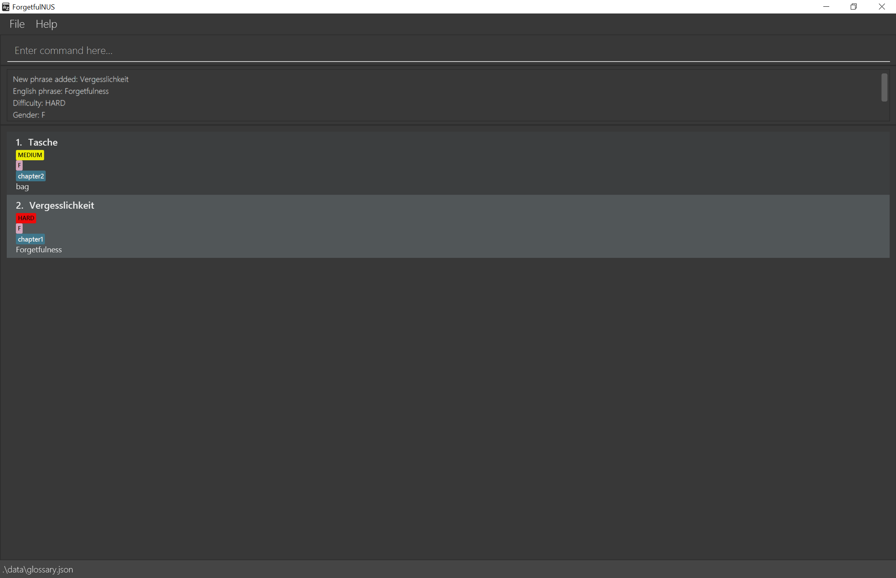
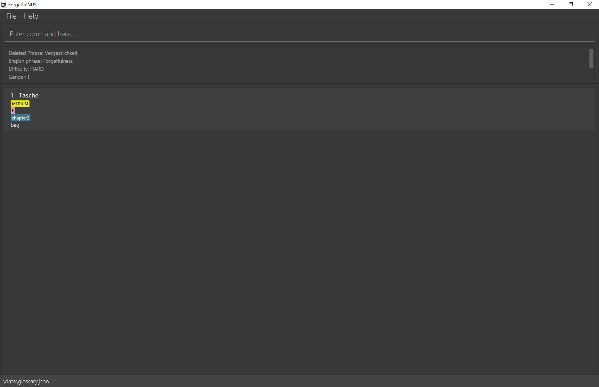
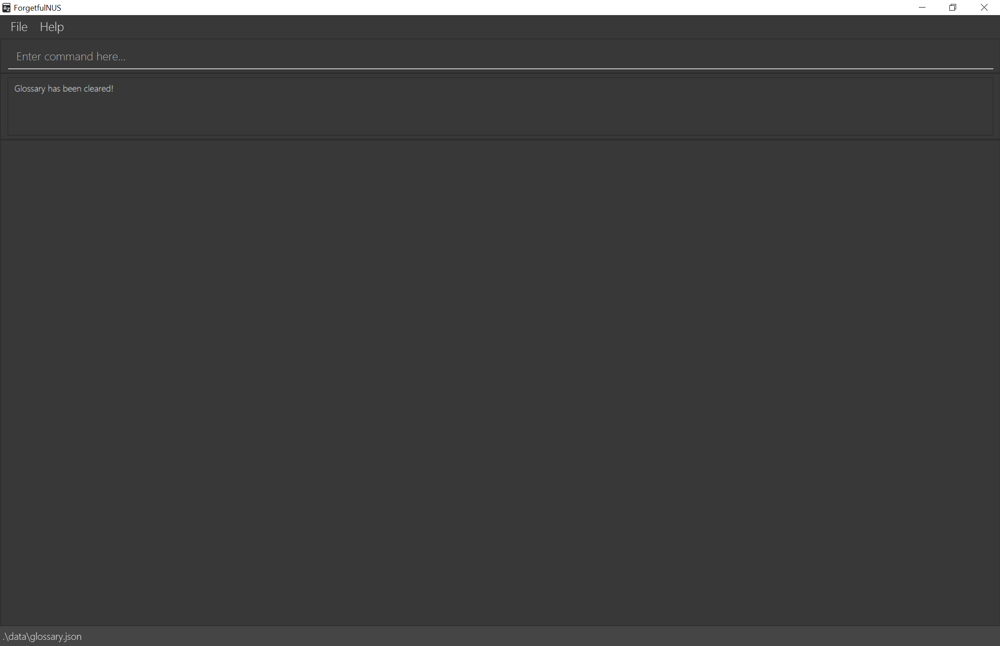
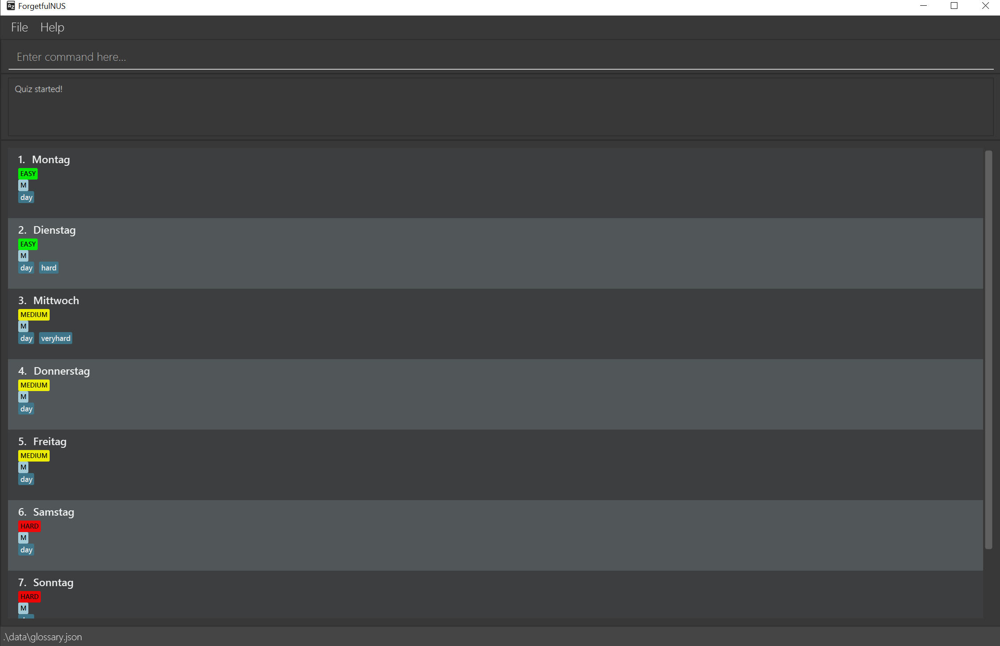
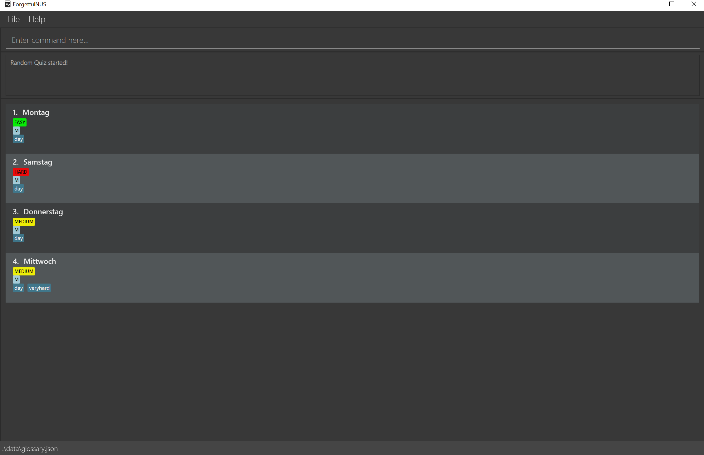
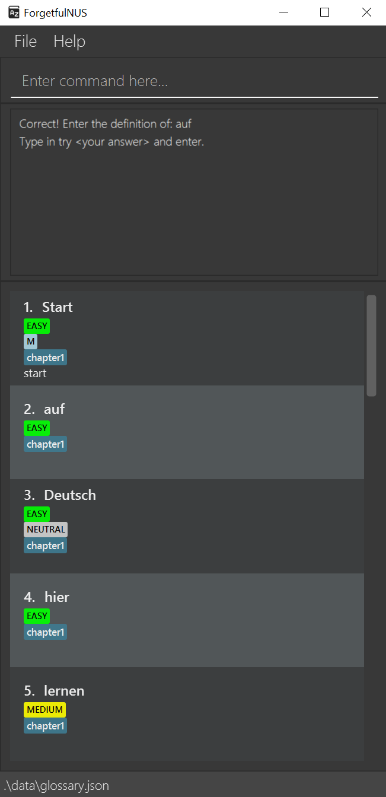
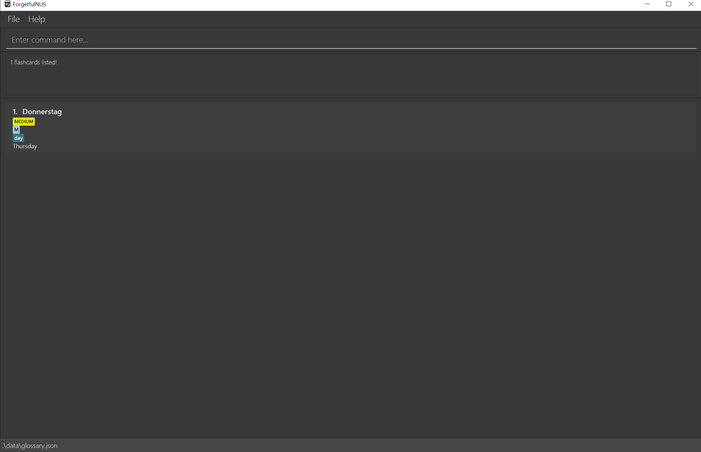
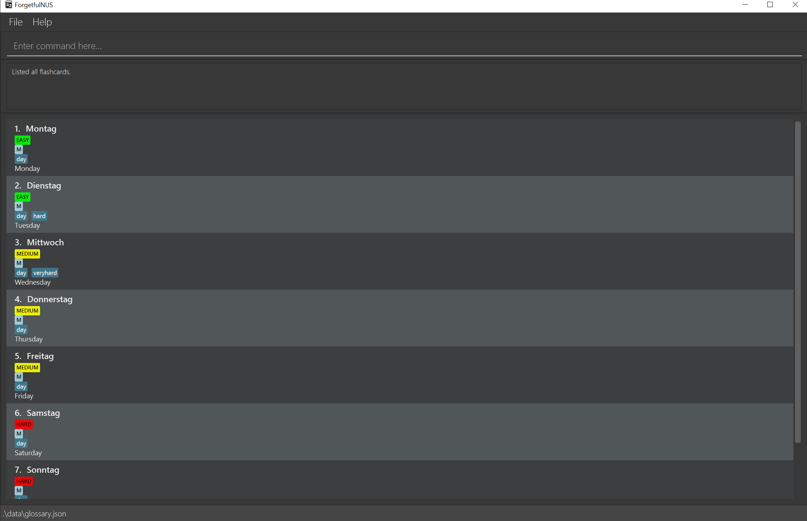
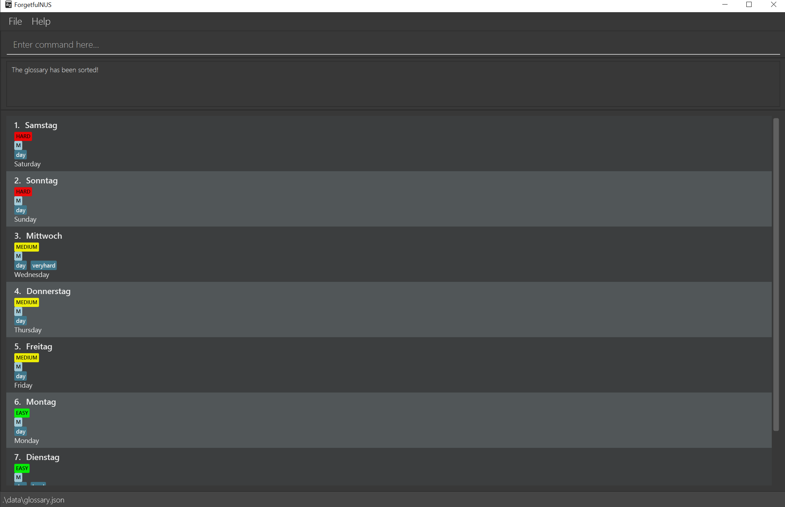

ForgetfulNUS is a desktop glossary app for students taking German 1 (LAG1201)
and German 2 (LAG2201) in NUS to practise and test their vocabulary. This app is optimised
for use via a Command Line Interface (CLI). If you can type fast, ForgetfulNUS 
can get your German revision done quickly and effectively.

## Table of Contents

1. [Quick Start](#qs)
1. [Commonly used Commands](#cucmds)
1. [Features](#features)
    1. [Edit the glossary](#editing)
        1. [Add a Flashcard](#add)
        1. [Delete a Flashcard](#delete)
        1. [Clear All Flashcards](#clear)
    1. [Test Yourself](#test)
        1. [Normal Test](#quiz)
        1. [Random Test](#random)
        1. [Next](#next)
        1. [Try](#try)
        1. [End Testing](#end)
        1. [View Past Scores](#scores)
    1. [Navigate the glossary](#navigating)
        1. [Find a Flashcard](#find)
        1. [List All Flashcards](#list)
        1. [Sort All Flashcards](#sort)
    1. [Miscellaneous Commands](#misc)
        1. [Help](#help)
        1. [Exit](#exit)
1. [FAQ](#faq)
1. [Command Summary](#cmdsum)

--------------------------------------------------------------------------------------------------------------------

## 1. Quick start

1. Ensure you have Java `11` or above installed in your Computer.

1. Download the latest `ForgetfulNUS.jar` from [here](https://github.com/AY2021S1-CS2103T-W16-2/tp/releases).

1. Copy the file to the folder you want to use as the _home folder_ for your ForgetfulNUS.

1. Double-click the file to start the app. When it first starts up, ForgetfulNUS should look similar to the figure below. ForgetfulNUS contains some pre-loaded
 sample data for you to get started.  
   

1. Type the command in the command box and press Enter to execute it. e.g. typing **`help`** and pressing Enter will open the help window. 
  
  ## 2. Commonly used commands
  
   Here are some example commands you can try:

   * **`add`**`g/Vergesslichkeit e/Forgetfulness` : Adds a flashcard with German phrase `Vergesslichkeit` with English translation `Forgetfulness` to the glossary.

   * **`quiz`** : Starts a round of vocabulary testing with all existing flashcards in the glossary.

   * **`end`** : Ends a round of vocabulary testing.

   * **`exit`** : Exits the app.

Refer to the [Features](#features) below for details of each command.

--------------------------------------------------------------------------------------------------------------------

## 3. Features

**:information_source: Notes about the command format:** 

* Words in `UPPER_CASE` are the parameters to be supplied by the user. 
  e.g. in `add g/<GERMAN PHRASE> e/<ENGLISH PHRASE>`, `GERMAN PHRASE` and `ENGLISH PHRASE` are parameters which can be used as `add g/Vergesslichkeit e/Forgetfulness`.
  
* Items with `...` after them can be used multiple times including zero times.
  e.g. `g/<GERMAN PHRASE> [t/<TAG>]...` can be used as  (i.e. 0 times), t/objects, t/objects t/nouns etc.
  

* Items in `[]`, square brackets, are optional.
  e.g `g/<GERMAN PHRASE> [t/<TAG>]` can be used as g/Vergesslichkeit t/tutorialOne or as g/Vergesslichkeit.
  
* For commands using prefixes, only one or zero prefixes are allowed, except for `TAG`.

### 3.1. Edit the glossary
#### 3.1.1. Add a flashcard: `add`

Adds a flashcard to the glossary. You can use this to expand your glossary.

Format: `add g/<GERMAN PHRASE> e/<ENGLISH PHRASE> d/[<DIFFICULTY>] s/[<GENDER>] [t/<TAG>]}`

**:information_source: Notes about add command:** 

* Difficulty has only three states, EASY, MEDIUM and HARD.
  If left blank, by default it will be MEDIUM.
  
* Gender has only four states, M (Masculine), F (Feminine), NEUTRAL or NONE.
  If left blank, by default it will be NONE.
  

Example:
* `add g/Vergesslichkeit e/Forgetfulness d/hard s/f t/chapter1`

After entering this command, your app should look like this:

#### 3.1.2. Delete a flashcard : `delete`

Deletes the specified flashcard from the glossary permanently. You can use this command to delete flashcards you consider outdated or not relevant to your learning. 

Format: `delete <INDEX>`

* Deletes the flashcard at the specified `INDEX`.
* The index refers to the index number shown in the displayed glossary.
* The index **must be a positive integer** 1, 2, 3, …​

Example:
* `delete 2` deletes the 2nd flashcard in the glossary.
 
After entering this command, your app should look like this:

#### 3.1.3. Clear All Flashcards : `clear`

Deletes all flashcards from the glossary permanently.

Format: `clear`

After entering this command, your app should look like this:

### 3.2. Test Yourself
#### 3.2.1. Normal Test : `quiz`

Starts a round of vocabulary testing with all the flashcards that are currently in the glossary. English translation is now hidden for the user to self test. You can use this command to test if you remember the definition corresponding to the German phrase on the flashcards.

Format: `quiz`

After entering this command, your app should look like this:

#### 3.2.2. Random Test : `random`

Starts a round of vocabulary testing like the previous quiz command but with the specified number of flashcards randomly selected from the existing glossary. You can use this command when you want a quick quiz where you can decide the number of questions.

Format: `random <NUMBER>`

Example: 
* `random 4` starts a randomised quiz with 4 randomly selected flashcards.
    
After entering this command, your app should look like this:
    

Note that screenshot might not look exactly the same on your end as flashcards are randomised.

#### 3.2.3. Next : `next`
Skips the current flashcard and move on to the next card in quiz mode. You can use this command if you cannot get the correct answer but wish to continue with the quiz. The current flashcard will be considered incorrectly answered.

Format: `next`

After entering this command, your app should look like this:

#### 3.2.4. Try : `try`
Compares the user attempt with the definition of the current flashcard. You can use this command when the app asks you to enter the definition on a flashcard. If the attempt is correct, the quiz will move on to the next flashcard. If the attempt is not correct, users will be prompted to try again or skip this card.

Format: `try <ATTEMPT>`

Example: 'try Tuesday'

After entering this command, your app should look like this:

#### 3.2.5. End Test : `end`

Ends the round of vocabulary testing. You can use this anytime during the quiz and the quiz score will be the number of correct attempts to that point.

Format: `end`

After entering this command, your app should look like this:

#### 3.2.6. View Past Scores : `scores`

Displays a history of scores from past quizzes, starting from the most recent round. The German phrases tested in these
rounds are also listed for easy reference.

**:information_source: Notes about saving scores:** 

* For each unique list of German phrases, only the most recent score is saved. If you decide to test
yourself on the same list again, your previous score will be overwritten.
  

After entering this command, your app should look like this:

### 3.3. Navigate the glossary

These commands allow you to manipulate the the glossary so you can find certain phrases more easily.

#### 3.3.1. Find a Flashcard : `find`

Finds certain flashcard(s) according to the **German phrase** entered. You can enter more german phrases after the first phrase to search for more flashcards corresponding to your search parameters. **The full German phrase must be entered for each parameter**.

Format: `find <GERMAN PHRASE> <OPTIONAL GERMAN PHRASE 1> <OPTIONAL GERMAN PHRASE 2>...`

Examples:
* `find Donnerstag` finds the flashcard(s) with the German Phrase 'Donnerstag'.
    
After entering this command, your app should look like this:

#### 3.3.2. List All Flashcards : `list`

Displays all flashcards in the glossary. You can use this command to return to the full glossary after a find operation.

Format: `list`

After entering this command, your app should look like this:

### 3.3.3. Sort All Flashcards : `sort`

Sorts the all flashcards according to the way you choose. You may find this helpful for browsing the flashcards or changing the order for quiz mode.

Format: `sort <PARAMETER>`

* `<PARAMETER>` refers to how you want to sort the flashcards by.
* Possible parameters:
    1. `german`: sorts by the alphabetical order of German phrases.
    1. `english`: sorts by the alphabetical order of English definitions.
    1. `reversegerman`: sorts by the reverse alphabetical order of German phrases.
    1. `reverseenglish`: sorts by the reverse alphabetical order of English phrases.
    1. `easytohard`: sorts by difficulty of flashcards, from easy to hard.
    1. `hardtoeasy`: sorts by difficulty of flashcards, from hard to easy.
    1. `earliest`: sorts by chronological order, from the earliest flashcard added to latest.
    1. `latest`: sorts by chronological order, from the latest flashcard added to earliest.

Examples:
* `sort hardtoeasy` sorts the flashcards by their respective difficulty tags from "hard" to "easy".

After entering this command, your app should look like this:

### 3.4. Miscellaneous Commands
#### 3.4.1. Help : `help`

Opens a small window containing a link to this User Guide. You can use this command when you need to refer to the command formats or how to run the app.

Format: `help`

#### 3.4.2 Exit the program : `exit`

Saves and exits the program.

Format: `exit`

--------------------------------------------------------------------------------------------------------------------

## 4. FAQ

**Q**: Do I need to save my data manually? 
**A**: ForgetfulNUS glossary data is automatically saved in the hard disk upon exiting. There is no need to save manually.

**Q**: How do I transfer my data to another Computer? 
**A**:
1. Install the app in your other computer.
1. Locate the `data` folder in your previous ForgetfulNUS home folder, and find the `glossary.JSON` file inside.
1. Transfer the `glossary.JSON` file to your new computer
1. Place the `glossary.JSON` file in the `data` folder of the ForgetfulNUS home folder in your other computer.

--------------------------------------------------------------------------------------------------------------------

## 5. Command Summary

Action | Format, Examples
--------|------------------
**Add** | `add g/<GERMAN PHRASE> e/<ENGLISH PHRASE> [d/<DIFFICULTY>] [s/<GENDER>] [t/<TAGS>...]`   e.g., `add g/Vergesslichkeit e/Forgetfulness d/hard`
**Delete** | `delete INDEX`   e.g., `delete 3`
**Clear** | `clear`
**Start Normal Quiz** | `quiz`
**Start Random Quiz** | `random <NUMBER>`   e.g., `random 5`
**Next phrase** | `next`
**Try an answer** | `try <ATTEMPT>`   e.g., `try Tuesday`
**End Quiz** | `end`
**Find** | `find <GERMAN PHRASE>`   e.g., `find Vergesslichkeit`
**List** | `list`
**Sort** | `sort <PARAMETER>`   e.g., `sort english`
**Help** | `help`
**Exit** | `exit`
